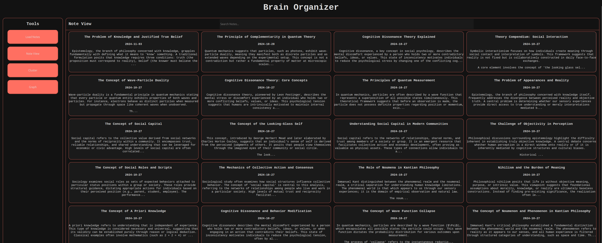
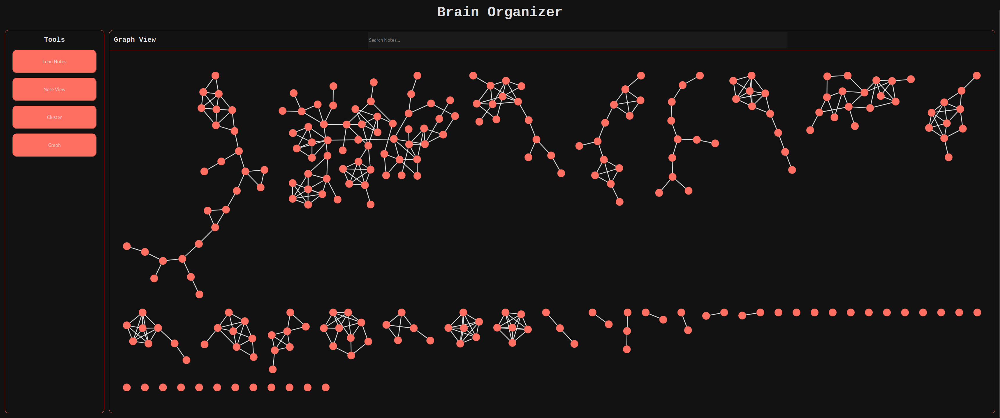

# Brain Organizer
(Still developing)
<br>
Semantic search and visualization tool for personal notes. Uses sentence-transformer embeddings to convert notes into a semantic vector space, allowing notes to be searched, clustered, and visualized based on meaning rather than exact text.

Currently, Google Keep notes exported through Google Takeout are supported. A set of sample notes can be found in `tests/llm`.

Includes:
- a command-line interface for analysis and troubleshooting
- a web-based GUI for interactive 

---
## Tools
### Semantic Search
Search notes by meaning. Example: > "music theory" can retrieve notes with topics related to music theory.

### Clustering
Group notes into semantic categories.

### Interactive Visualization
Visualize notes in an interactive graph with Cytoscape.
<br>
---

## Install
Clone the repository and install dependencies:
```bash
git clone https://github.com/KSHobbyProjs/brain-organizer.git
cd brain-organizer
pip install -r requirements.txt
```
Dependencies include `numpy`, `scipy`, `scikit`, `sentence-transformers`, `torch`, etc. A CUDA-enabled GPU is recommended for embedding large collections of notes.

---

## Usage
- A sample set of notes can be found in `tests/llm`. When loading, select `llm` as the parser method.
### GUI
- Start the server with `./run.py` or `python run.py`
- Open `http://localhost:8000`
- Click the load notes button to import local notes.

### Command Line
- Run `./cli.py path/to/keepnotes` or `python cli.py path/to/keepnotes` without any extra commands to enter the REPL
- Type a search query in terminal to search for the top 5 notes. Example: `brain> nihilism` will output the top 5 notes best matching "nihilism" in content.
- `:open 5` will open the fifth note output from the search result.
- `:cluster 5` will cluster the notes into 5 categories and output to the terminal.
- `:visualize-graph` will send a semantic graph of the notes to Cytoscape (if open).
- `:help` prints additional commands.
- Possible command arguments include:
    -  `--query "foo bar"`: searches notes for notes with content best matching "foo bar" and displays the top 5 in terminal.
    - `--cluster 5`       : uses KMeans to produce 5 clusters out of the data and displays three notes in each sector in terminal.
    - `--visualize`       : produces a plot of the embedded notes in 2D / 3D with highlighted clusters.
    - `--timeline`        : produces a histogram of note creation over time.
---


